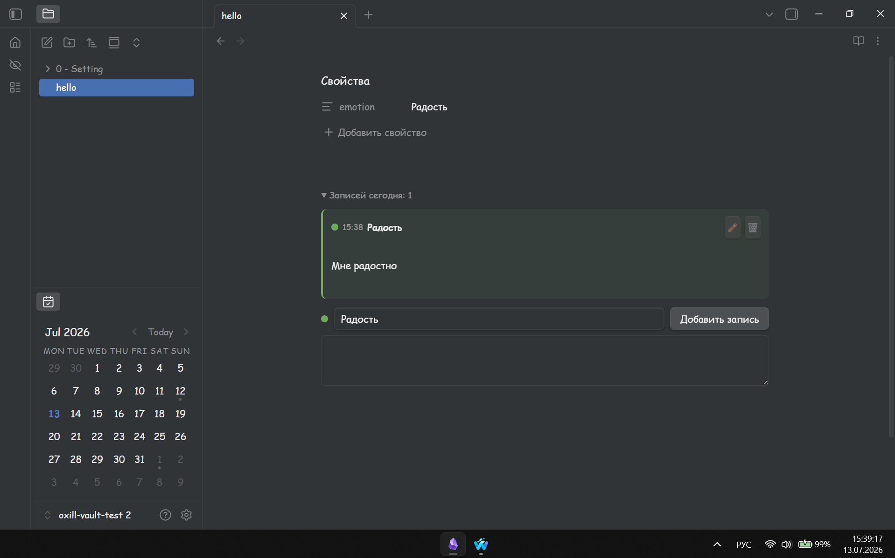

# Emotion Book

An [Obsidian](https://obsidian.md) plugin for tracking your emotional state directly inside daily notes.

## How it works

Add the block to any note:

````
```emotion-book
```
````

A form appears with an emotion selector and a text field. Fill it in, hit **Add entry** — the record saves instantly with a timestamp. You can add as many entries as you want throughout the day. All past entries are tucked under a collapsible so your note stays clean.

After each entry the plugin automatically calculates the average emotion for the day and writes it to the `emotion` property in your frontmatter. This makes it easy to query with Dataview across your entire vault.



## Features

- One-tap emotion logging with color-coded indicators
- Multiple entries per day with timestamps
- Edit or delete any entry inline
- Auto-calculated daily average written to frontmatter as `emotion`
- Fully customizable emotion list — labels, colors, and numeric weights
- Color picker in settings for each emotion

## Installation

1. Download `main.js` and `manifest.json` from the latest release
2. Create a folder `.obsidian/plugins/emotion-book/` in your vault
3. Place both files inside
4. Open Obsidian → Settings → Community plugins → enable **Emotion Book**

## Settings

Go to Settings → Emotion Book to manage your emotion list. You can add, rename, and delete emotions, pick a color for each one, and set a numeric weight that affects how the daily average is calculated.

## License

MIT
